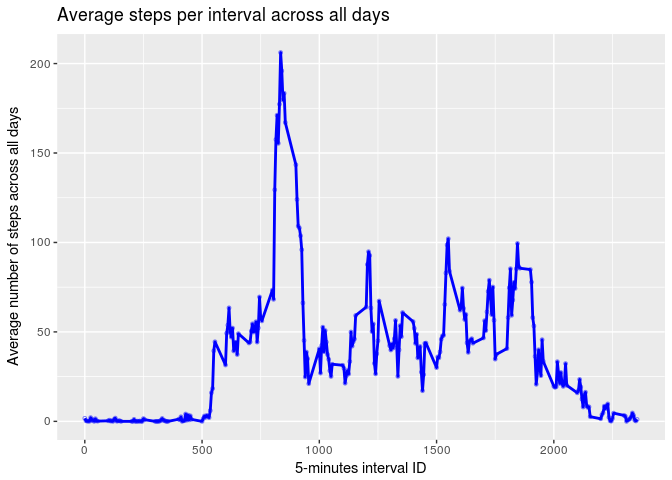
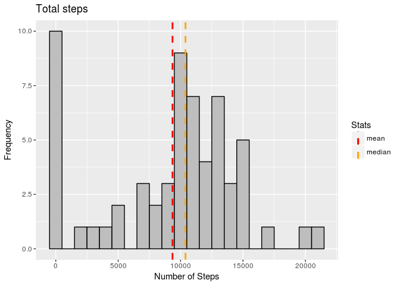
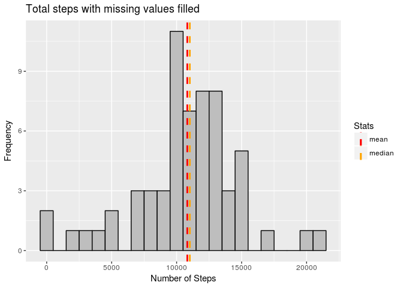
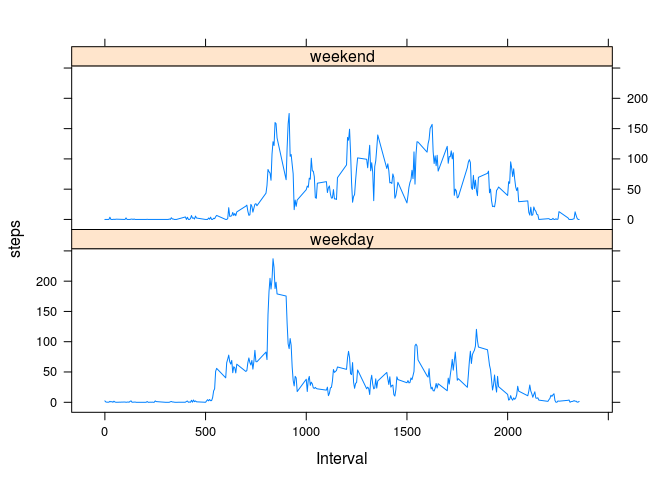

# Reproducible Research: Peer Assessment 1
## Introduction

The following research describes the activity pattern of a person based on his/her activity during the day. Activity is based on the number of steps taken during the day.

Source data: https://d396qusza40orc.cloudfront.net/repdata%2Fdata%2Factivity.zip

The variables included in this dataset are:

**steps:** Number of steps taking in a 5-minute interval (missing values are coded as NA)

**date:** The date on which the measurement was taken in YYYY-MM-DD format

**interval:** Identifier for the 5-minute interval in which measurement was taken

The dataset is stored in a comma-separated-value (CSV) file and there are a total of 17,568 observations in this dataset.


## Loading and preprocessing the data

Data must be loaded from the .csv file:


```r
raw_data<-read.csv("activity.csv", header=TRUE, stringsAsFactors = TRUE)
```

Let's format the Date column as Posix Date:


```r
raw_data$date<-as.Date(raw_data$date)
```

## What is mean total number of steps taken per day?

In order to answer this question a new data set will be generated with the average number of steps
and the date:


```r
data_hist<-aggregate(raw_data$steps, by=list(raw_data$date), FUN=sum, na.rm=TRUE)
names(data_hist)<-c("Date", "Steps")
```
This data can be used to plot an histogram. The mean and the median are useful values that will be 
shown in the histogram.

Mean and median:

```r
mean(data_hist$Steps)
```

```
## [1] 9354.23
```

```r
median(data_hist$Steps)
```

```
## [1] 10395
```


Histogram for average daily steps:


```r
hist1<-ggplot(data_hist, aes(x=Steps))+
      geom_histogram(color="black", fill="gray", binwidth = 1000)+
      geom_vline(aes(xintercept=mean(Steps), color="mean"), linetype="dashed", size=1)+
      geom_vline(aes(xintercept=median(Steps), color="median"), linetype="dashed", size=1)+
      labs(title="Total steps",x="Number of Steps", y = "Frequency")+
      scale_colour_manual('Stats', values = c('mean'='red','median'='orange'))
hist1
```

<!-- -->

## What is the average daily activity pattern?

Next step is to calculaye the average daily activity pattern. This is the average number of steps
taken during each one of the interval.

First, a new data set will be created with the data to plot:


```r
data_time<-aggregate(raw_data$steps, by=list(raw_data$interval), FUN=mean, na.rm=TRUE)
names(data_time)<-c("Interval", "Steps")
```

The plot for this info is:

```r
ggplot(data_time, aes(x=Interval, y=Steps))+
  geom_line(size=1, color= "blue") +
  geom_point(color = "blue", size=1, pch = 21, alpha=0.5)+
  labs(title="Average steps per interval across all days",x="5-minutes interval ID", y = "Average number of steps across all days")
```

<!-- -->

One good question to aks is which 5-minute interval, on average across all the days in the dataset, contains the maximum number of steps?. The answer can be calculated with this command:


```r
data_time[data_time$Steps==max(data_time$Steps),]
```

```
##     Interval    Steps
## 104      835 206.1698
```

## Imputing missing values

In the current data set there are many NA values. The total number is:

```r
sum(!complete.cases(raw_data))
```

```
## [1] 2304
```

There are several mechanisms to infere these missing values. The most quick one is to infere the average total number of steps, based on the data from section 1. By doing this it's possible to quickly compare both results.

First, let's find out the missing days and store their values in a data set:

```r
days<-unique(raw_data[is.na(raw_data$steps),]$date)
days
```

```
## [1] "2012-10-01" "2012-10-08" "2012-11-01" "2012-11-04" "2012-11-09"
## [6] "2012-11-10" "2012-11-14" "2012-11-30"
```

Next, the total steps per day can be calculated:

```r
total_steps<-aggregate(raw_data["steps"], by=list(Date=raw_data$date), FUN=sum)
```

Calculate the average total steps for each one the week days. This value will be used to fill the missing data in the total_steps data set.

```r
weekday_value<-aggregate(total_steps["steps"], list(weekday=weekdays(total_steps$Date)), FUN=mean, na.rm=TRUE)
```

Fill the values:

```r
for(dayn in 1:nrow(weekday_value)){
  total_steps[is.na(total_steps$steps)&weekdays(total_steps$Date)==
                weekday_value[dayn,1],2]<-weekday_value[dayn,2]
}
```

Let's check if total_steps still has missing values:

```r
sum(!complete.cases(total_steps))
```

```
## [1] 0
```

Now we can plot the new dataset and compare it with the previous plot:


```r
hist2<-ggplot(total_steps, aes(x=steps))+
  geom_histogram(color="black", fill="gray", binwidth = 1000)+
  geom_vline(aes(xintercept=mean(steps), color="mean"), linetype="dashed", size=1)+
  geom_vline(aes(xintercept=median(steps), color="median"), linetype="dashed", size=1)+
  labs(title="Total steps with missing values filled",x="Number of Steps", y = "Frequency")+
  scale_colour_manual('Stats', values = c('mean'='red','median'='orange'))
```

Let's compare how different is the histogram with the missing values filled than the original histogram:


```r
hist1
```

<!-- -->

```r
hist2
```

<!-- -->

The main difference between plots is that the number of values equal to 0 is much lower in the second histogram. This might be a good thing because the NAs values in the original histogram could mislead the researcher to think there are a lot of intervals with 0 steps taken.


## Are there differences in activity patterns between weekdays and weekends?

For this calculation a new data set with missing values filled and with information about the day type (weekend or weekday) must be generated.

First, let's get mean values for each interval for each day of the week

```r
mean_values_interval<-aggregate(.~interval+weekdays(raw_data$date), raw_data, mean, na.rm=TRUE)
```

Now let's fill the missing values


```r
data_filled_interval<-raw_data

for(int_value in 1:nrow(data_filled_interval)){

  #if data is missing and interval and weekday is the same as the row with the data missing,
  #retrieve the value and fill the row.
  if (is.na(data_filled_interval[int_value,1])){
     data_filled_interval[int_value,1] <- mean_values_interval[mean_values_interval$interval==data_filled_interval[int_value,3]&mean_values_interval$`weekdays(raw_data$date)`==weekdays(data_filled_interval[int_value,2]),3]
  }
  
  # Create a new column with the weekday
  data_filled_interval$weekday[int_value]<-weekdays(data_filled_interval[int_value,2])
  
  # Create a new column with the day type (weekday or weekend)
  daytype<-as.POSIXlt(data_filled_interval[int_value,2])$wday
  
  if (daytype==0|daytype==6){
    data_filled_interval$day_type[int_value]<-c("weekend")
  } else {
    data_filled_interval$day_type[int_value]<-c("weekday")
  }

}
```

Let's get the average values per interval for weekdays and weekends.


```r
daytype_data<-aggregate(data_filled_interval["steps"], by=list(Day_type=data_filled_interval$day_type, Interval=data_filled_interval$interval), FUN=mean)
```

With the data set ready, let's plot average values per interval for weekdays and weekends


```r
xyplot(steps~Interval | Day_type, data=daytype_data, type="l", layout=c(1,2))
```

<!-- -->

